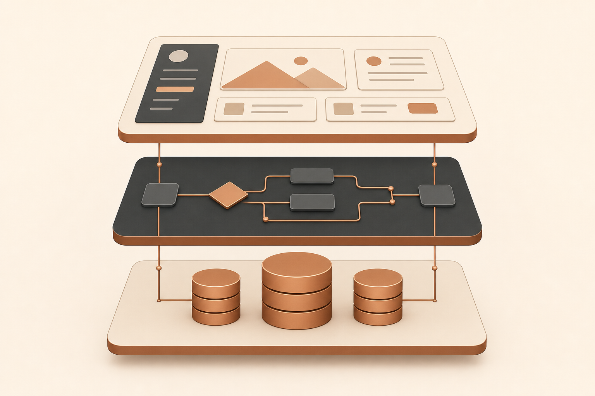
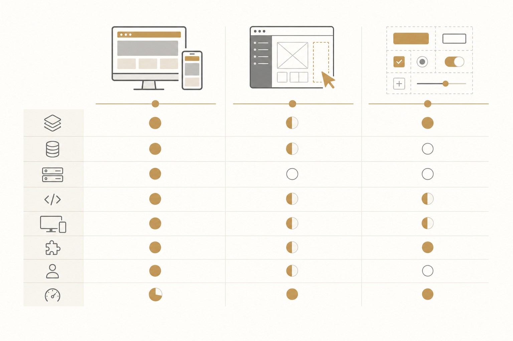

# בניית אתרים ב-AI ב-2026: Lovable, Bolt או v0?

לפני שנתיים, "לבנות אתר" עוד היה תהליך של שבועות — בחירת platform, עיצוב mockups, פיתוח, deployment. ב-2026 — אותו אתר יכול לקום ב-15 דקות מ-prompt אחד. אבל הבחירה במה להשתמש כבר לא טריוויאלית, ושלושת השמות שאי אפשר להתעלם מהם השנה הם **Lovable**, **Bolt.new**, ו-**v0 של Vercel**.

שלושתם הופכים תיאור בטקסט לקוד עובד, אבל הם פותרים בעיות שונות לחלוטין. הציטוט שתפסתי מ-Till Freitag, שותף של monday.com, מסכם את זה ביעילות: *"Lovable לאפליקציות full-stack עם בסיסי נתונים, Bolt לפרוטוטיפים מהירים, v0 לרכיבי UI נקיים — רוב הפרויקטים מרוויחים משילוב."*

נצלול לכל אחד.

## Lovable — אלוף ה-Full-Stack

**קטגוריה:** בונה אפליקציות מלא
**Tech stack:** React + Vite + Tailwind

### מה הוא עושה טוב

- מייצר אפליקציות שלמות, כולל מסד נתונים ומערכת הרשאות מובנים
- קוד נקי ב-TypeScript ו-Tailwind CSS לפי הסטנדרטים בתעשייה
- Deployment בקליק אחד ל-Lovable Cloud או GitHub
- עריכה ויזואלית — לא חייבים prompt כדי לשנות דברים
- תשתית backend מובנית דרך Lovable Cloud

### איפה הוא נחלש

- רק React + Vite. אין Next.js, Vue או Svelte
- מודל credit-based — נגמר מהר כשעובדים אינטנסיבית
- רק אפליקציות web. אין mobile native

### למי זה מתאים

יזמים שצריכים MVP עם מסד נתונים והרשאות בזמן מינימלי. צוותים שבונים אתרים ואפליקציות מקצועיות.

## Bolt.new — הפרוטוטיפר המהיר

**קטגוריה:** פרוטוטיפ Full-Stack
**Tech stack:** React, Next.js, Svelte, Vue ועוד

### מה הוא עושה טוב

- טכנולוגיית WebContainer מספקת מהירות יצירה חריגה
- תומך במספר frameworks מעבר ל-React
- Preview משולב עם הזנת-משוב מיידית בדפדפן
- מסד נתונים והרשאות נוספו ב-2025
- Free tier נדיב עם token יומי

### איפה הוא נחלש

- איכות הקוד יורדת ככל שהדרישות מורכבות יותר (לעומת Lovable)
- בפרויקטים גדולים — אובדן הקשר אחרי כמה איטרציות
- מוגבל באינטגרציה לקוד קיים

### למי זה מתאים

ולידציה מהירה של רעיון — pivot, pitch, או POC. מפתחים שצריכים גמישות framework. צוותים שצריכים להראות concept תוך 30 דקות.

## v0 של Vercel — מומחה ה-UI

**קטגוריה:** מחולל רכיבי UI
**Tech stack:** React + Next.js + Tailwind

### מה הוא עושה טוב

- מייצר רכיבי Next.js באיכות production עם איכות קוד עליונה
- מצב עיצוב ויזואלי — אפשר לערוך רכיבים בדפדפן
- אינטגרציה חלקה עם Vercel — edge functions, analytics
- ב-tier הפרימיום יש המרה מ-Figma לקוד
- גישה ממוקדת-רכיבים, מצוין למערכות עיצוב

### איפה הוא נחלש

- אין backend, מסד נתונים, או הרשאות מובנים
- מותאם בכבדות ל-Next.js, פחות גמישות
- מודל פרימיום עם free tier מצומצם
- מתאים לרכיבים, לא לאפליקציות שלמות

### למי זה מתאים

מפתחים ומעצבים שבונים רכיבי UI לתוך פרויקטים קיימים של Next.js. צוותים שמייצרים מערכת עיצוב. ארגונים שכבר ב-Vercel ecosystem.

## ההשוואה המעשית

שלושת הכלים קיבלו אותו prompt: *"בנה טופס יצירת קשר עם ולידציה ששומר נתונים למסד נתונים."*

| היבט | Lovable | Bolt.new | v0 |
|---|---|---|---|
| איכות UI | ⭐⭐⭐⭐ נקי, רספונסיבי | ⭐⭐⭐ פונקציונלי | ⭐⭐⭐⭐⭐ pixel-perfect |
| ולידציה | ✅ Zod + react-hook-form | ✅ בסיסית | ✅ Zod + react-hook-form |
| מסד נתונים | ✅ Supabase אוטומטי | ✅ משולב | ❌ הגדרה ידנית |
| Deployment | ✅ קליק | ✅ קליק | ✅ דרך Vercel |
| זמן נדרש | ~10 דק׳ | ~5 דק׳ | ~15 דק׳ (+ backend) |

## כמה זה עולה? (מרץ 2026)

| מסלול | Lovable | Bolt.new | v0 |
|---|---|---|---|
| חינם | 5 credits/יום | tokens יומיים | 7 הודעות/יום, $5/חודש credits |
| Pro | מ-$20/חודש | מ-$20/חודש | $20/חודש |
| Team | מ-$50/חודש | מ-$53/חודש | מ-$30/חודש |
| מודל חיוב | credit-based | token-based | credit-based |

## איך לבחור — לפי המקרה שלך

**Lovable** — אם:
- את צריכה MVP עובד עם מסד נתונים והרשאות
- את בונה אתר או אפליקציה מקצועית ל-deployment
- את רוצה קוד React נקי וקריא לטווח ארוך
- את לא רוצה לטפל ב-DevOps בעצמך

**Bolt.new** — אם:
- את צריכה לוודא concept תוך 30 דקות
- את צריכה גמישות framework מעבר ל-React
- את בונה פרוטוטיפ, לא תוכנה production

**v0** — אם:
- את בונה רכיבי UI לפרויקט Next.js קיים
- את דורשת את איכות הקוד והעיצוב הגבוהה ביותר
- את כבר עובדת באקוסיסטם של Vercel

**הקומבינציה המנצחת:** v0 לרכיבים בודדים → Lovable לארכיטקטורת האפליקציה הכוללת → Claude Code לליטוש production.

## הערה לפני שמשגרים ל-production

ללא קשר לכלי שתבחרי, **קוד שנוצר ב-AI דורש סקירה מקצועית לפני השקה**. בדיקות אבטחה, אופטימיזציית ביצועים, והערכת maintainability — אלה לא רשות. הם הכרח לפני שהקוד עולה ל-production.

הכלים האלה משנים את החוקים של איך בונים אתרים — אבל לא משנים את החוקים של איך *בודקים* אותם.

---

**מקור המאמר:** [Lovable vs. Bolt vs. v0 – Which AI Web Builder Is Right for You?](https://till-freitag.com/en/blog/lovable-vs-bolt-vs-v0-en) מאת Malte Lensch, פורסם 24.02.2026.

